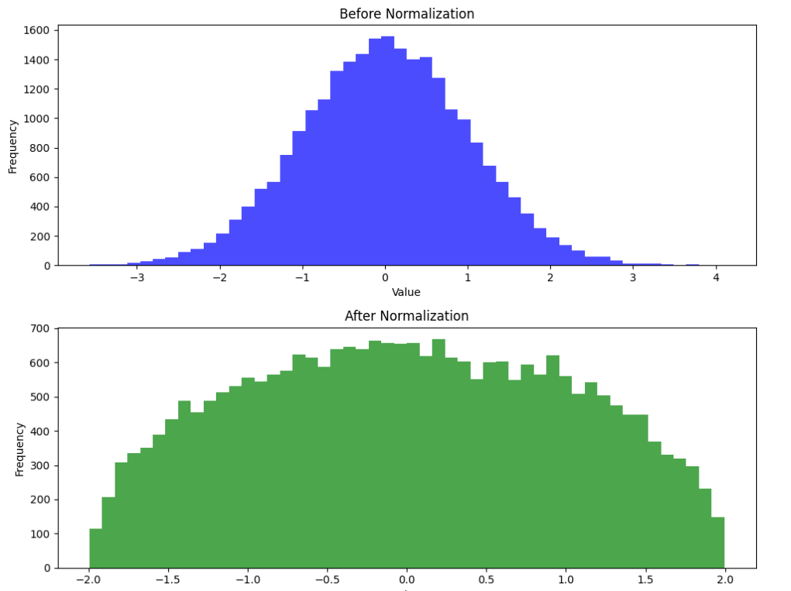

# MindSpore实现RevIN（可逆实例归一化）

## 项目介绍

这个项目是使用MindSpore深度学习框架实现的可逆实例归一化（Reversible Instance Normalization，简称RevIN）的示例代码。RevIN是一种归一化技术，其特点是在进行归一化的同时可以保留原始数据的信息，以便于进行反向操作（即“反归一化”），这在某些需要恢复原始数据的场景下非常有用。

## 功能特点

- **可逆性**：与传统的实例归一化不同，RevIN不仅提供了归一化功能，还提供了反归一化功能，可以恢复原始数据。
- **灵活性**：支持自定义特征数量、数值稳定性参数（eps）以及是否使用仿射变换。
- **易用性**：提供了清晰的接口和示例代码，方便用户快速上手。

## 使用方法

1. **环境准备**：确保已经安装了MindSpore深度学习框架。

2. **代码使用**：

   - 实例化`RevIN`类，指定特征数量和其他可选参数。
   - 使用`construct`方法进行数据的归一化或反归一化，通过`mode`参数控制操作模式（`'norm'`为归一化，`'denorm'`为反归一化）。

3. **示例代码**：

   ```python
   import numpy as np  
   import mindspore as ms  
   from revin import RevIN  
     
   # 生成示例数据  
   data = np.random.randn(1000, 5, 5).astype(np.float32)  
   x = ms.Tensor(data, ms.float32)  
     
   # 实例化RevIN  
   revin = RevIN(num_features=5)  
     
   # 进行归一化  
   normalized_x = revin.construct(x, mode='norm')  
     
   # 进行反归一化（如果需要）  
   # denormalized_x = revin.construct(normalized_x, mode='denorm')
   ```

4. **可视化**：代码中还包含了使用matplotlib绘制归一化前后数据分布的例子，便于直观观察归一化的效果。

   

## 注意事项

- 确保MindSpore版本与代码兼容。
- 在进行反归一化之前，请确保已经保存了归一化时的参数（如均值和标准差），这些参数在反归一化过程中是必需的。
- 如果遇到任何问题或错误，请检查数据维度和类型是否与预期一致。

## 版权声明

此代码仅供学习和研究使用，如有商业使用需求，请遵守相关法律法规和开源协议。

